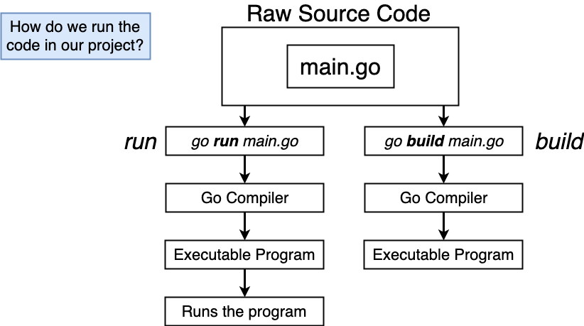
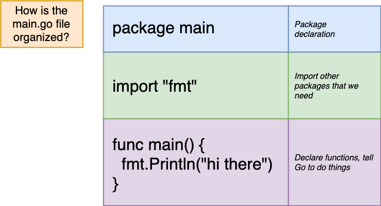
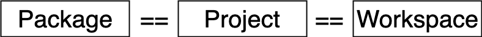
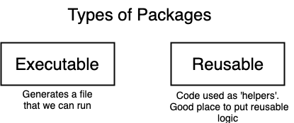
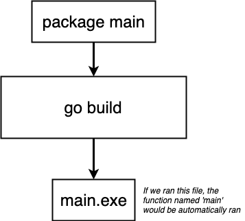
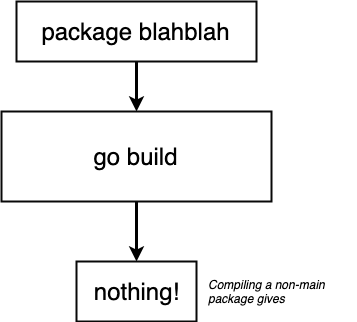
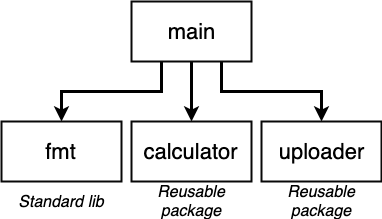
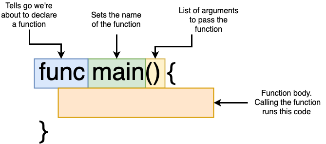

# Week 1

## Golang Introduction

### 1. Helloworld

- Create new folder `helloworld`
- Inside `helloworld` create file `main.go` with following contents
    ```
    package main

    import "fmt"

    func main() {
        fmt.Println("Hello world")
    }
    ```

- Run the following command

    ```
    go run main.go
    ```
    or
    ```
    go build main.go
    ./main
    ```

    

### 2. How is the `main.go` file oranized?



### 3. What is `package`?



### 3.1. How many types of package?



### 3.2. What happens when build `executable` package?

- Only `main` package is `executable` package
- `main` package must contain function `main()` to be executed



### 3.3. What happens when build `reusable` pakage?



### 4. What does `import "fmt"` mean?

- `fmt` is a Golang standard library package (just like other `reusable` package)
- We `import "fmt"` to use function in `fmt` package
- To see what can `fmt` do, and other built-in packages, take a look at [https://golang.org/pkg/](https://golang.org/pkg/)
- For example we import `fmt`, `calculator` and `uploader`
    

### What does `func` mean?

- `func` is a keyword of Golang, to declare a function

    
